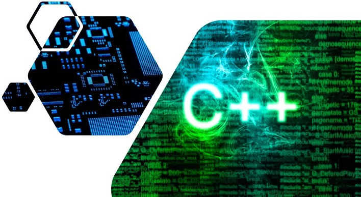

# Advanced Programming for Computer Design Problems

The course (ECE 5960-023/6960-025) teaches you how to write *good* programs
with a specific focus on solving computer design problems.
You will gain hands-on experience in writing C++/Python code for 
implementing important data structures and algorithms,
such as graphs, dynamic programming, and machine learning
that are fundamental to this domain.

# Class Logistics

+ Instructor: [Prof. Tsung-Wei Huang][Tsung-Wei Huang]
  + Email: tsung-wei.huang@utah.edu
  + Office: MEB 2124
+ Time: 3:30 PM - 6:30 PM every Thursday
+ Room: MEB 2555
+ Webpage: [https://github.com/tsung-wei-huang/ece5960](https://github.com/tsung-wei-huang/ece5960)
+ Scoring
  + In-class practice: 40 points
  + Programming Assignment 1: 20 points
  + Programming Assignment 2: 20 points
  + Programming Assignment 3: 20 points
  + No Exams
+ Office hour: 1-3 PM every Wed (feel free to email for additional appointments)
+ Textbook: No
+ [Utah ECE course catalog](https://student.apps.utah.edu/uofu/stu/ClassSchedules/main/1204/class_list.html?subject=ECE)

# Syllabus

The class will teach you the following topipcs:

+ Computer design automation flows and problems
+ Modern C++ programming language (idioms, STL, etc.)
+ Core guideline and best practice for programming
+ Performance tuning and optimization
+ Implementation of important data structures and algorithms
+ Parallel and heterogeneous computing
+ Other advanced topics and new research trends

# Lecture Notes

| Lecture  | Topics | Slides | Programming Practice | Assignment | Due | Note |
| :-:      | :-:    | :-:    | :-:                  | :-:        | :-: | :-:  |
| 2020/1/9 | Introduction | [lecture1](slides/lecture1.pdf) | [icp1](icp/20200109/) | [hw0](hw/hw0.pdf) | -   | [CADE access](slides/no-machine-CADE.pdf) |
| 2020/1/16 | Divide and Conquer | [lecture2](slides/lecture2.pdf) | [icp2](icp/20200116/) | - | -   | - |
| 2020/1/23 | TBD | TBD | TBD | - | icp2 | - |

---

[Tsung-Wei Huang]:    https://tsung-wei-huang.github.io/
[Tsung-Wei GitHub]:   https://github.com/twhuang-uiuc
